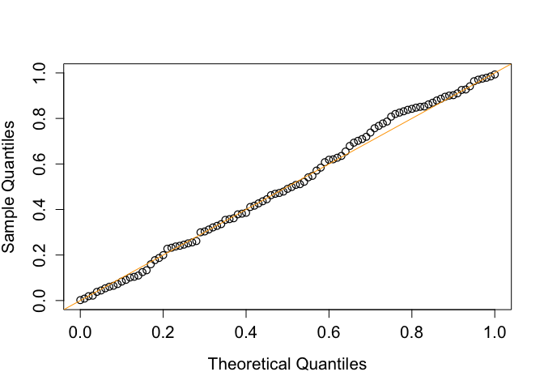

<!-- README.md is generated from README.Rmd. Please edit that file -->

# Cross Test Inference for Mediation Analysis (ctima)

<!-- badges: start -->

<!-- badges: end -->

The goal of ctima is to assess whether and how a specific continuous or
categorical exposure affects the outcome of interest through one
mediator using a two-way cross test (CT). The CT method allows to make
inference for composite null hypotheses of no mediation effect,
providing valid type I error control and thus optimizes statistical
power. For more technical details, refer to Chen, C., Zhou, L., Song,
P.X.K. (2025), “An Efficient Two-Way Cross Test for Mediation Effects
with High Sensitivity to Weak Signals” arXiv preprint.

## Installation

Install the development version of ctima like so:

``` r
# Install ctima from GitHub:
devtools::install_github("canyi-chen/ctima")
```

## Example 1

This is a single example that shows steps of using the cross test (CT)
to test for the null hypothesis of no mediation effect under the linear
structural equation models.

``` r
library(ctima)


## Set up parameters
alpha_S <- beta_M <- 1/4

set.seed(2)
data <- generate_all_data(
  n = 200,
  alpha_S = alpha_S,
  beta_M = beta_M
)
S <- data$S
M <- data$M
Y <- data$Y
X <- data$X

ctYlm.Mglm(
  S,
  M,
  Y,
  X
)
#> $NIE
#> [1] 0.06890527
#> 
#> $p_value_NIE
#> [1] 0.040719
#> 
#> $NDE
#> [1] 1.037831
#> 
#> $p_value_NDE
#> [1] 1.707052e-30
#> 
#> $NTE
#> [1] 1.106737
#> 
#> $p_value_NTE
#> [1] 5.256695e-35
#> 
#> attr(,"class")
#> [1] "ctYlm.Mglm.Result"
```

## Example 2

This example shows the use of abYlm.Mglm function for generalized linear
model on the mediator.

``` r
library(ctima)


## Set up parameters
M.family <- poisson()
alpha_S <- beta_M <- 1/15

set.seed(2)
data <- generate_all_data(
  n = 200,
  alpha_S = alpha_S,
  beta_M = beta_M,
  M.family = M.family
)
S <- data$S
M <- data$M
Y <- data$Y
X <- data$X

ctYlm.Mglm(
  S,
  M,
  Y,
  X,
  M.family = M.family
)
#> $p_value_NIE
#> [1] 0
#> 
#> attr(,"class")
#> [1] "ctYlm.Mglm.Result"
```

## Example 3

This exmaple shows that the performance of adaptive bootstrap test in
the type I error control under the composite null hypothesis.

``` r
## Load libraries
library(ctima)

if (rlang::is_installed("future.apply")) {
  library(future.apply)
  plan(multisession, workers = 12)
} else {
  install.packages("future.apply")
  library(future.apply)
  plan(multisession, workers = 12)
}
#> Warning: package 'future.apply' was built under R version 4.4.1
#> Loading required package: future
```

``` r


## Set up parameters
M.family <- gaussian()
Y.family <- gaussian()

simulation <- function(alpha_S = 0, beta_M = 0) {
  data <- ctima::generate_all_data(
    n = 500,
    alpha_S = alpha_S,
    beta_M = beta_M,
    M.family = M.family,
    Y.family = Y.family
  )
  S <- data$S
  M <- data$M
  Y <- data$Y
  X <- data$X

  out <- ctima::ctYlm.Mglm(
    S,
    M,
    Y,
    X
  )
  out
}


## Empirical distribution of the p value
# the number of replication for approximating the distribution of the p value
Nreps <- 200
alpha_S <- beta_M <- 0
output <- future_replicate(Nreps, simulation(0, 0))


plot(
  seq(0, 1, 0.01),
  quantile(unlist(output[2,]), probs = seq(0, 1, 0.01)),
  pch = 1,
  cex = 1.2,
  cex.lab = 1.3,
  cex.axis = 1.3,
  ylab = "Sample Quantiles",
  xlab = "Theoretical Quantiles",
  type = "p",
  xlim = c(0, 1),
  ylim = c(0, 1),
  lwd = 1.2
)
abline(0, 1, col = "orange")
```


